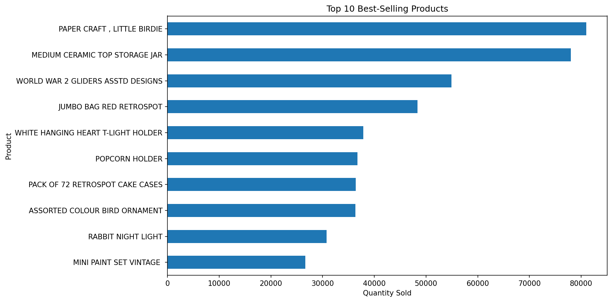
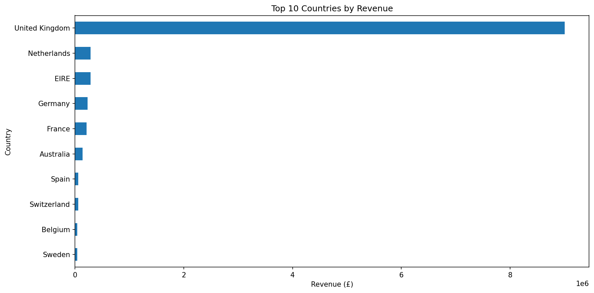
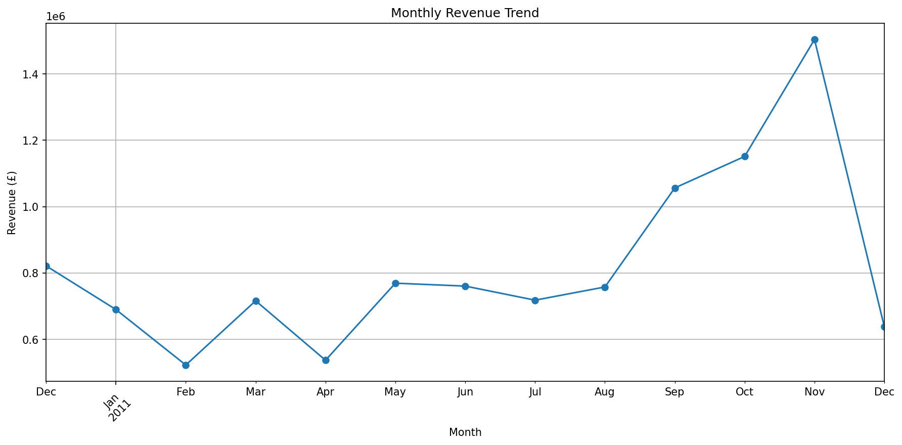
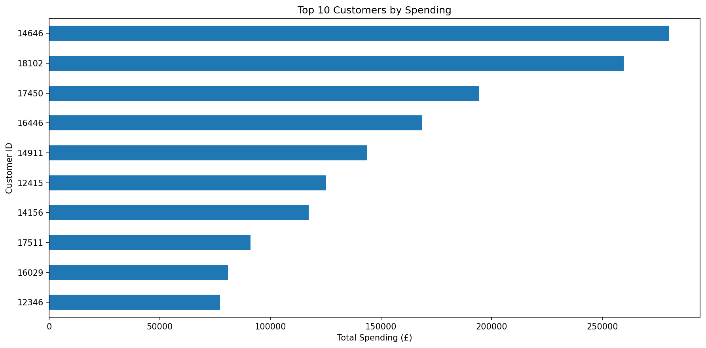
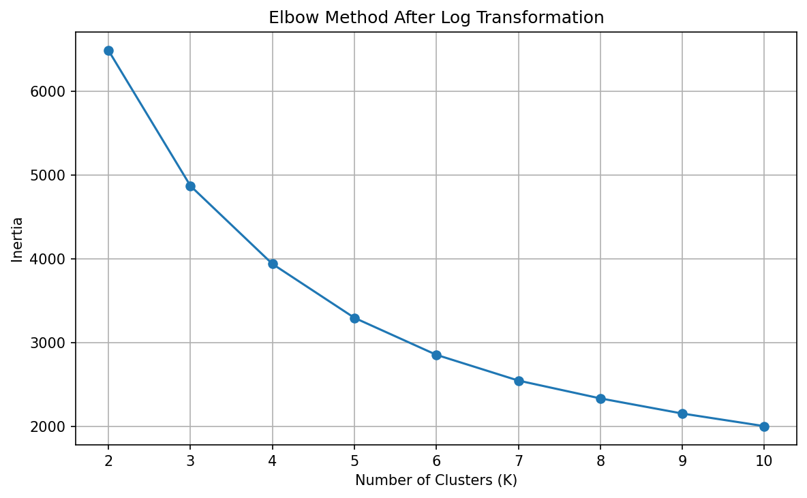
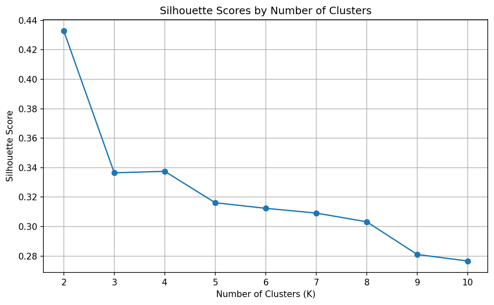
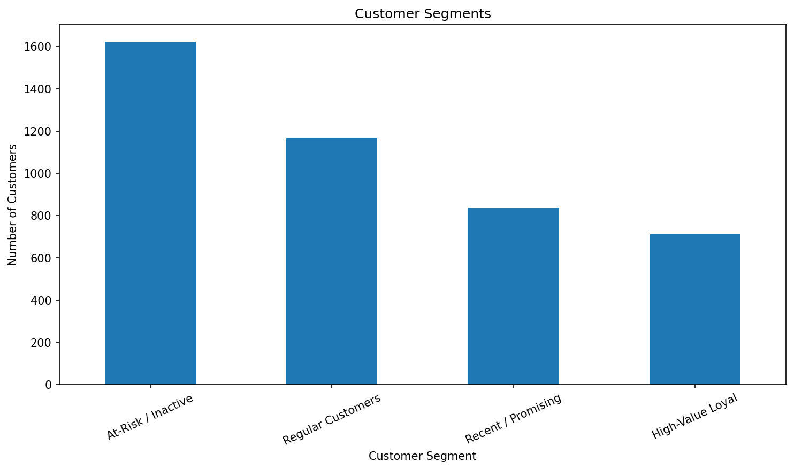

# E-Commerce Customer & Sales Analysis


An end-to-end data science project analysing more than 500,000 UK online retail transactions using Python.

The project covers data cleaning, exploratory data analysis, feature engineering, data visualisation, RFM customer analysis, and K-Means customer segmentation to generate practical business insights.

---

## Project Overview

The objective of this project is to analyse real-world e-commerce transaction data and answer important business questions such as:

- How much revenue did the business generate?
- How many orders and customers are present?
- Which products sell the most?
- Which countries generate the most revenue?
- Who are the highest-value customers?
- How does revenue change over time?
- Can customers be grouped based on purchasing behaviour?
- What actions could the business take based on these insights?

---

## Dataset

**Dataset:** UCI Online Retail Dataset

The dataset contains more than **500,000 transaction records** from a UK-based online retailer.

### Original Dataset Size

- **Rows:** 541,909
- **Columns:** 8

### Original Columns

| Column | Description |
|---|---|
| InvoiceNo | Unique invoice/order number |
| StockCode | Product identifier |
| Description | Product description |
| Quantity | Number of items purchased |
| InvoiceDate | Transaction date and time |
| UnitPrice | Price per unit |
| CustomerID | Unique customer identifier |
| Country | Customer country |

Dataset source:

https://archive.ics.uci.edu/dataset/352/online-retail

---

## Technologies Used

- Python
- Pandas
- NumPy
- Matplotlib
- Scikit-learn
- Jupyter Notebook
- Google Colab
- Git
- GitHub

---

## Project Workflow

```text
Raw Dataset
    ↓
Data Understanding
    ↓
Data Cleaning
    ↓
Feature Engineering
    ↓
Exploratory Data Analysis
    ↓
Data Visualisation
    ↓
RFM Customer Analysis
    ↓
Log Transformation
    ↓
Standardisation
    ↓
K-Means Clustering
    ↓
Customer Segmentation
    ↓
Business Recommendations
```

---

## 1. Data Understanding

The initial dataset was inspected using Pandas to understand:

- Dataset dimensions
- Column names
- Data types
- Missing values
- Descriptive statistics
- Date range
- Invalid quantities and prices

The initial dataset contained:

```text
541,909 rows
8 columns
```

Missing values were identified mainly in:

- `Description`
- `CustomerID`

The dataset also contained cancelled orders, duplicate transactions, negative quantities, and invalid prices.

---

## 2. Data Cleaning

The following cleaning steps were performed:

- Removed duplicate transactions
- Removed cancelled invoices
- Removed negative quantities
- Removed zero or negative unit prices
- Retained valid anonymous sales for overall sales analysis
- Removed missing `CustomerID` values only when performing customer-level analysis

After cleaning, the main sales dataset contained:

```text
524,878 transactions
```

A separate customer dataset was created for RFM analysis.

---

## 3. Feature Engineering

Several new variables were created to support analysis.

### Revenue

```python
Revenue = Quantity * UnitPrice
```

Additional time-based features were created from `InvoiceDate`:

- `Month`
- `DayOfWeek`
- `Hour`

These features allow sales behaviour to be analysed across different periods.

---

## 4. Key Business Metrics

The cleaned dataset produced the following headline results:

| Metric | Result |
|---|---:|
| Total Revenue | **£10,642,110.80** |
| Total Orders | **19,960** |
| Unique Customers | **4,338** |
| Leading Revenue Market | **United Kingdom** |
| Highest Full-Month Revenue | **November 2011** |

---

## 5. Product Analysis

The analysis identified the products with the highest total quantity sold.

The leading product was:

**PAPER CRAFT, LITTLE BIRDIE**

with approximately:

**80,995 units**

Other high-selling products included:

- MEDIUM CERAMIC TOP STORAGE JAR
- WORLD WAR 2 GLIDERS ASSTD DESIGNS
- JUMBO BAG RED RETROSPOT
- WHITE HANGING HEART T-LIGHT HOLDER
- POPCORN HOLDER

### Visualisation



---

## 6. Country Analysis

The United Kingdom generated the majority of total revenue.

Other important international markets included:

- Netherlands
- EIRE
- Germany
- France
- Australia
- Spain
- Switzerland
- Belgium
- Sweden

### Visualisation



The results show that the business is strongly concentrated in the UK while still having meaningful international demand.

---

## 7. Monthly Revenue Analysis

Monthly revenue was calculated to identify sales trends over time.

Revenue increased strongly during the later months of 2011.

**November 2011** recorded the highest full-month revenue.

The final December value should be interpreted carefully because the dataset only contains transactions until **9 December 2011**, meaning December is an incomplete month.

### Visualisation



---

## 8. Top Customers

Customer spending was calculated by grouping transactions using `CustomerID`.

This helped identify the customers generating the highest total revenue.

### Visualisation



Understanding these high-value customers can help businesses develop loyalty programmes and personalised marketing strategies.

---

# RFM Customer Analysis

RFM analysis was used to measure customer behaviour.

RFM stands for:

### Recency

How recently a customer made a purchase.

Lower Recency is generally better.

### Frequency

How many unique orders the customer made.

Higher Frequency indicates stronger engagement.

### Monetary

How much money the customer spent.

Higher Monetary value indicates higher customer value.

---

## RFM Preparation

The RFM variables had very different ranges and contained highly skewed values.

To prepare the data for K-Means clustering:

1. RFM values were calculated.
2. A logarithmic transformation was applied.
3. `StandardScaler` was used to standardise the features.
4. Different values of K were evaluated.
5. Elbow and Silhouette methods were examined.

---

## Elbow Method

The Elbow Method was used to examine the relationship between the number of clusters and within-cluster inertia.



---

## Silhouette Analysis

Silhouette scores were also calculated for different values of K.



Although a smaller number of clusters produced a higher Silhouette Score, **K = 4** was selected as a balance between statistical separation and business interpretability.

Four clusters provide more actionable customer groups for marketing and customer relationship management.

---

# Customer Segmentation

The final K-Means model produced four customer groups.

| Segment | Avg. Recency | Avg. Frequency | Avg. Monetary | Customers |
|---|---:|---:|---:|---:|
| High-Value Loyal | 12.17 | 13.75 | £8,088.02 | 713 |
| At-Risk / Inactive | 181.51 | 1.32 | £341.00 | 1,622 |
| Recent / Promising | 17.70 | 2.19 | £557.32 | 837 |
| Regular Customers | 71.64 | 4.08 | £1,801.78 | 1,166 |

---

## High-Value Loyal Customers

These customers:

- Purchased recently
- Purchase frequently
- Spend significantly more than other groups

They are the business's most valuable customer segment.

### Recommended Strategy

- VIP rewards
- Loyalty programmes
- Exclusive discounts
- Early access to products
- Personalised recommendations

---

## At-Risk / Inactive Customers

This is the largest customer group.

These customers:

- Have not purchased for a long time
- Purchase infrequently
- Generate relatively low spending

### Recommended Strategy

- Re-engagement email campaigns
- Limited-time discounts
- Personalised reminders
- Product recommendations
- Win-back campaigns

---

## Recent / Promising Customers

These customers purchased recently but have not yet become frequent buyers.

They represent an opportunity to develop future loyal customers.

### Recommended Strategy

- Follow-up promotions
- Second-purchase discounts
- Product recommendations
- Email engagement
- Loyalty programme invitations

---

## Regular Customers

These customers demonstrate repeat purchasing behaviour and moderate spending.

They are valuable but have not reached the level of the high-value segment.

### Recommended Strategy

- Personalised promotions
- Loyalty points
- Cross-selling
- Product bundles
- Repeat-purchase incentives

---

## Customer Segment Distribution



The largest segment is **At-Risk / Inactive Customers**, showing a significant opportunity for customer reactivation.

---

# Business Recommendations

Based on the analysis, the following recommendations were developed.

### 1. Retain High-Value Customers

High-value loyal customers should receive personalised treatment, loyalty rewards, and exclusive promotions.

### 2. Re-Engage Inactive Customers

The large inactive customer group represents a major opportunity for targeted reactivation campaigns.

### 3. Convert Recent Customers into Repeat Buyers

Recent customers should receive follow-up offers and personalised recommendations to encourage repeat purchases.

### 4. Maintain Stock of High-Demand Products

The highest-selling products should be closely monitored to reduce the risk of stock shortages.

### 5. Develop International Markets

The UK remains the core market, but countries such as the Netherlands, EIRE, Germany, and France show strong international potential.

### 6. Prepare for Peak Sales Periods

Inventory and marketing campaigns should be prepared ahead of the strong September-November sales period.

### 7. Repeat Customer Segmentation

RFM analysis should be repeated periodically so customer strategies can adapt to changing purchasing behaviour.

---

# Project Structure

```text
01-Ecommerce-Customer-Sales-Analysis/
│
├── README.md
├── requirements.txt
│
├── data/
│   ├── customer_segments.csv
│   ├── cluster_profile.csv
│   └── online_retail_cleaned_sample.csv
│
├── notebooks/
│   └── ecommerce_customer_sales_analysis_READY.ipynb
│
├── src/
│   └── ecommerce_analysis.py
│
├── images/
│   ├── monthly_revenue.png
│   ├── top_products.png
│   ├── top_countries.png
│   ├── top_customers.png
│   ├── elbow_method.png
│   ├── silhouette_scores.png
│   └── customer_segments.png
│
└── reports/
    └── Ecommerce_Customer_Sales_Analysis_Report.pdf
```

---

# How to Run the Project

## Option 1 — Google Colab

Open:

```text
notebooks/ecommerce_customer_sales_analysis_READY.ipynb
```

Upload it to Google Colab.

Then select:

```text
Runtime → Run all
```

The notebook can automatically download the UCI Online Retail dataset if the dataset is not already available.

---

## Option 2 — Run the Python Script

Clone or download the repository.

Install the required libraries:

```bash
pip install -r requirements.txt
```

Then run:

```bash
python src/ecommerce_analysis.py
```

The script will perform the analysis and generate the project outputs.

---

# Data Files

Because the complete cleaned dataset contains more than 500,000 records and is too large for convenient browser-based GitHub upload, the repository includes:

```text
online_retail_cleaned_sample.csv
```

This contains a sample of the cleaned dataset.

The complete cleaned dataset can be generated automatically by running the notebook or Python script.

The repository also includes:

```text
customer_segments.csv
```

containing the final RFM and K-Means customer segmentation results.

---

# Skills Demonstrated

This project demonstrates practical experience with:

- Python programming
- Pandas
- NumPy
- Data cleaning
- Exploratory Data Analysis
- Feature engineering
- Data visualisation
- Customer analytics
- RFM analysis
- Data transformation
- Feature scaling
- Machine learning
- K-Means clustering
- Model evaluation
- Business intelligence
- Business recommendation development
- Git
- GitHub
- Open-source project documentation

---

# Future Improvements

Possible future improvements include:

- Interactive dashboards using Power BI or Streamlit
- Customer lifetime value prediction
- Product recommendation systems
- Sales forecasting
- Churn prediction
- Advanced anomaly detection
- Automated reporting
- Deployment as an interactive analytics application

---

# Author

**Muhammad Hassan**

Data Analyst | Python | SQL | Power BI | Machine Learning | Open Source

---

# License

This project is part of the **Data-Analytics-Projects** repository and is available under the MIT License.

---

## Contributions

Feedback, issues, and contributions are welcome.

If you find an improvement or additional analysis that could strengthen the project, feel free to open an issue or submit a pull request.
