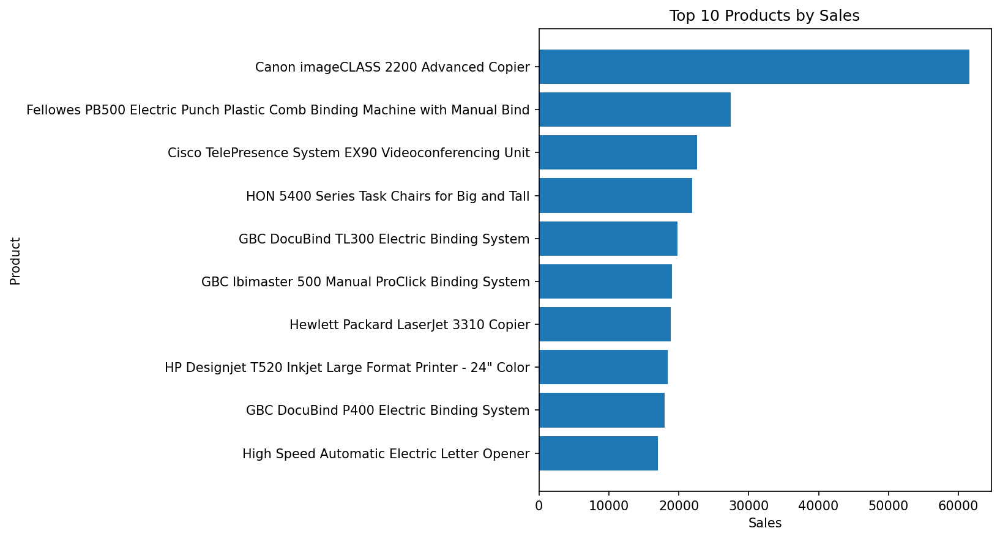
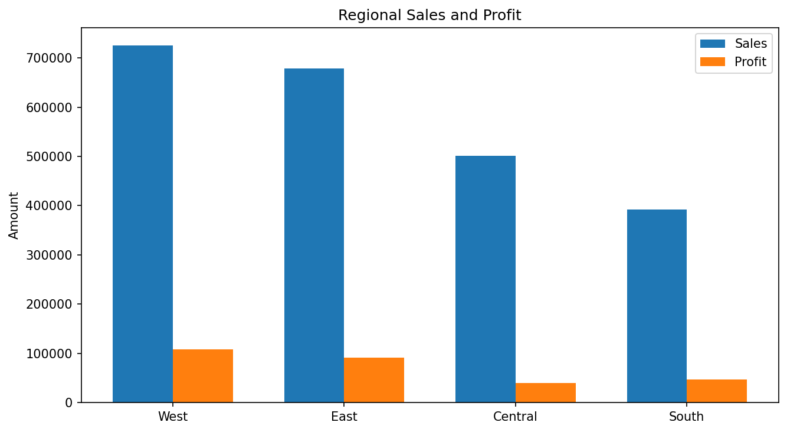
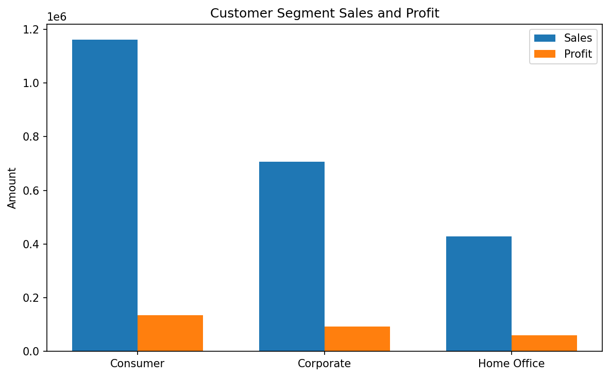
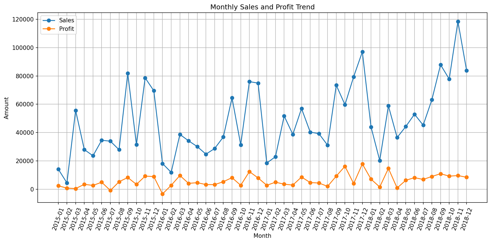
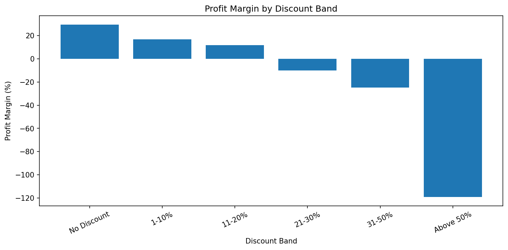

# Retail Sales SQL & Power BI Analysis


An end-to-end business intelligence project analysing retail sales, customers, products, regions, discounts and profitability using SQL and Power BI-ready data.

The project demonstrates practical SQL analysis, database design, advanced SQL techniques, business KPI development, data visualisation and preparation for an interactive Power BI dashboard.

---

## Project Overview

The objective of this project is to analyse retail sales data and answer important business questions such as:

- How much sales and profit does the business generate?
- What is the overall profit margin?
- How many customers and orders are present?
- Which products generate the most sales and profit?
- Which products generate high sales but poor profitability?
- Which customer segments perform best?
- Which customers place the most orders?
- Which regions and locations perform best and worst?
- How do sales and profit change over time?
- How does discounting affect profitability?
- Which shipping modes balance speed and profitability?
- How can these insights be presented in Power BI?

---

## Dataset

This project uses a public **Sample Superstore / Retail Superstore** dataset.

The dataset includes fields such as:

- Order ID
- Order Date
- Ship Date
- Ship Mode
- Customer ID
- Customer Name
- Segment
- Country
- City
- State
- Region
- Product ID
- Category
- Sub-Category
- Product Name
- Sales
- Quantity
- Discount
- Profit

The cleaned dataset used in the project is available in the `data/` folder.

---

## Technologies Used

- SQL
- MySQL
- SQLite
- Power BI
- DAX
- Python
- Pandas
- Matplotlib
- Jupyter Notebook
- Google Colab
- Git
- GitHub

---

## Project Workflow

```text
Raw Retail Dataset
        ↓
Data Understanding
        ↓
SQL Data Cleaning
        ↓
Database Preparation
        ↓
Business KPI Analysis
        ↓
Product Analysis
        ↓
Customer Analysis
        ↓
Regional Analysis
        ↓
Discount & Profitability Analysis
        ↓
Advanced SQL Analysis
        ↓
Business Visualisations
        ↓
Power BI Data Preparation
        ↓
DAX Measures
        ↓
Business Recommendations
```

---

# 1. Data Cleaning

The data-cleaning process includes:

- Removing duplicate records
- Validating customer, order and product identifiers
- Checking invalid or missing dates
- Removing non-positive sales where inappropriate
- Removing invalid quantities
- Validating discount values
- Standardising text fields
- Creating additional analytical fields

Additional derived fields include:

- `order_year`
- `order_quarter`
- `order_month`
- `shipping_days`
- `profit_margin_pct`

Negative profit values are retained because loss-making transactions are valid and important for profitability analysis.

---

# 2. Core Business KPIs

The SQL analysis calculates key business metrics including:

- Total Sales
- Total Profit
- Profit Margin
- Total Orders
- Total Customers
- Total Quantity
- Average Order Value
- Average Discount

These KPIs provide an executive-level view of business performance.

---

# 3. SQL Business Questions

The project answers 20 business questions using SQL.

### Overall Performance
1. What are total sales, total profit and overall profit margin?
2. How many unique orders and customers are in the dataset?
3. What is the average order value?

### Product Analysis
4. Which 10 products generate the highest sales?
5. Which 10 products generate the highest profit?
6. Which products generate high sales but negative profit?
7. Which categories and sub-categories perform best?

### Customer Analysis
8. Which customer segment generates the most sales and profit?
9. Who are the top 10 customers by lifetime sales?
10. Which customers place the most orders?

### Regional Analysis
11. Which regions generate the highest and lowest sales?
12. Which regions have the best and worst profit margin?
13. Which states or cities are loss-making?

### Time-Series Analysis
14. How do monthly sales and profit change over time?
15. What is the month-over-month sales growth rate?
16. Which month has the highest average profit per order?

### Profitability Analysis
17. How does discount level affect profitability?
18. What percentage of orders are profitable versus loss-making?

### Advanced SQL
19. Rank products within each category by sales.
20. Which shipping mode provides the strongest balance of delivery speed and profitability?

---

# 4. Advanced SQL Techniques

The project demonstrates:

- Common Table Expressions (CTEs)
- Window functions
- `RANK()`
- `LAG()`
- `CASE`
- Conditional aggregation
- Percentage calculations
- Month-over-month growth
- Customer-level aggregation
- Product ranking within categories

---

# 5. Product Analysis

Product analysis focuses on:

- Top products by sales
- Top products by profit
- Product quantities
- High-sales but loss-making products
- Category performance
- Sub-category performance
- Product profitability



---

# 6. Regional Analysis

Regional analysis compares:

- Sales
- Profit
- Profit margin
- Orders
- State performance
- City performance



---

# 7. Customer Segment Analysis

Customer segments are compared using:

- Total Sales
- Total Profit
- Number of Customers
- Number of Orders
- Profit Margin



---

# 8. Monthly Sales and Profit Trends

Monthly sales and profit are analysed to identify:

- Growth periods
- Weak periods
- Seasonal changes
- Month-over-month growth



---

# 9. Discount and Profitability Analysis

Discount levels are grouped into bands to understand whether aggressive discounting improves or harms profitability.



---

# 10. Power BI Preparation

The project includes a cleaned Power BI-ready dataset:

```text
powerbi/superstore_powerbi.csv
```

It also includes a DAX reference file:

```text
powerbi/powerbi_dax_measures.txt
```

### Core DAX Measures

- Total Sales
- Total Profit
- Total Orders
- Total Customers
- Total Quantity
- Profit Margin %
- Average Order Value
- Average Discount %
- Sales Previous Month
- Month-over-Month Growth %

---

# Planned Power BI Dashboard

## Page 1 — Executive Overview
- Total Sales
- Total Profit
- Profit Margin
- Total Orders
- Total Customers
- Average Order Value
- Monthly Sales & Profit Trend
- Date, Region and Category slicers

## Page 2 — Product Performance
- Category performance
- Sub-Category performance
- Top products by sales
- Top products by profit
- Loss-making products
- Sales vs Profit analysis

## Page 3 — Customer & Regional Analysis
- Customer segment performance
- Top customers
- Regional analysis
- State and City analysis
- Geographic visualisation

## Page 4 — Discount & Profitability
- Discount bands
- Profit margins
- Loss-making products
- Weak locations
- Profitability insights

> The SQL analysis and Power BI-ready data are complete. The interactive `.pbix` dashboard is the next development stage.

---

# Business Recommendations

1. Protect high-performing products by monitoring stock availability and demand.
2. Review loss-making products with high sales for pricing, discounting and cost issues.
3. Focus customer-retention activity on high-value and repeat customers.
4. Use regional profitability, not sales alone, when allocating resources.
5. Review aggressive discount bands that produce weak or negative margins.
6. Monitor month-over-month growth and investigate unusual declines quickly.
7. Use the Power BI dashboard as an ongoing management tool.

---

# Project Structure

```text
02-Retail-Sales-SQL-PowerBI/
│
├── README.md
│
├── data/
│   └── superstore_cleaned.csv
│
├── sql/
│   ├── database_setup.sql
│   ├── cleaning_queries.sql
│   └── analysis_queries.sql
│
├── powerbi/
│   ├── superstore_powerbi.csv
│   └── powerbi_dax_measures.txt
│
├── notebooks/
│   └── Hassan_Project_2_SQL_PowerBI_READY.ipynb
│
├── images/
│   ├── monthly_sales_profit.png
│   ├── top_products_sales.png
│   ├── regional_sales_profit.png
│   ├── customer_segment_performance.png
│   └── discount_profitability.png
│
└── reports/
    └── business_findings.txt
```

---

# How to Run the Project

## Option 1 — Google Colab

Open:

```text
notebooks/Hassan_Project_2_SQL_PowerBI_READY.ipynb
```

Upload it to Google Colab, then select:

```text
Runtime → Run all
```

The notebook automatically downloads the dataset, cleans the data, runs SQL analysis, generates visualisations, exports Power BI-ready data, and generates MySQL-ready SQL files and DAX measures.

## Option 2 — MySQL

Use the files in:

```text
sql/
```

Run `database_setup.sql`, import `data/superstore_cleaned.csv`, then run `cleaning_queries.sql` and `analysis_queries.sql`.

## Option 3 — Power BI

Import:

```text
powerbi/superstore_powerbi.csv
```

into Power BI Desktop.

Use:

```text
powerbi/powerbi_dax_measures.txt
```

as a reference when creating measures.

---

# Skills Demonstrated

- SQL
- MySQL
- SQLite
- Database design
- Data cleaning
- SQL aggregation
- CTEs
- Window functions
- `RANK()`
- `LAG()`
- `CASE`
- Business KPI analysis
- Product analytics
- Customer analytics
- Regional analytics
- Profitability analysis
- Time-series analysis
- Power BI preparation
- DAX
- Data visualisation
- Business intelligence
- Business recommendations
- Git
- GitHub
- Technical documentation

---

# Future Improvements

- Build the full Power BI `.pbix` dashboard
- Add interactive slicers and drill-downs
- Add dashboard screenshots
- Add a final PDF business intelligence report
- Create a star-schema data model
- Add SQL views for Power BI
- Add customer-level profitability analysis
- Add sales forecasting
- Add automated refresh workflows

---

# Author

**Muhammad Hassan**

Data Analyst | Python | SQL | Power BI | Machine Learning | Open Source

---

# License

This project is part of the **Data-Analytics-Projects** repository and is available under the MIT License.

---

## Contributions

Feedback, issues and contributions are welcome.

If you have an improvement, additional analysis idea or dashboard suggestion, feel free to open an issue or submit a pull request.
