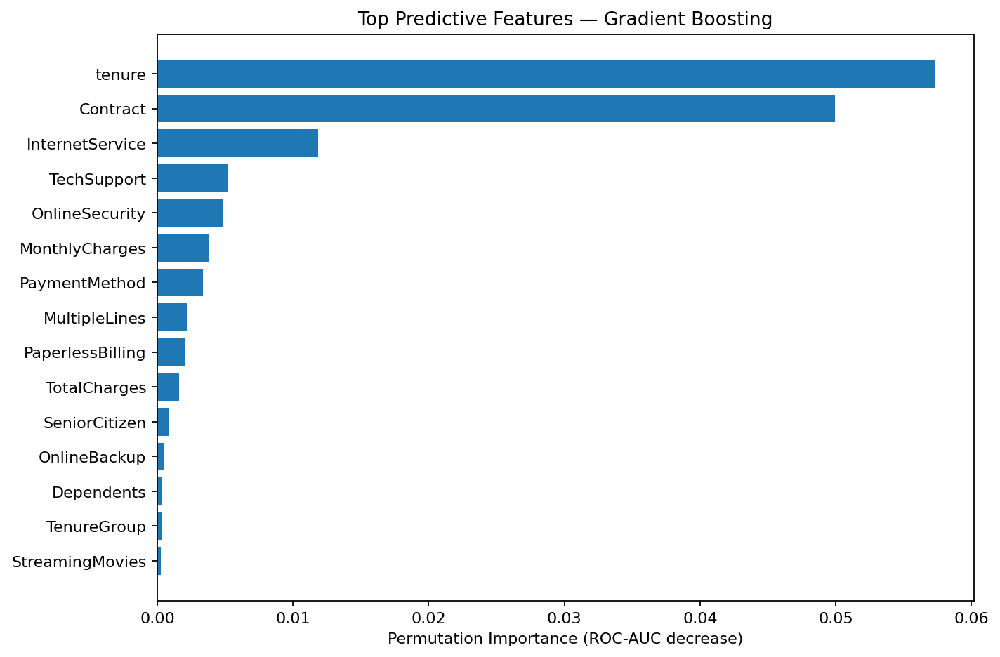
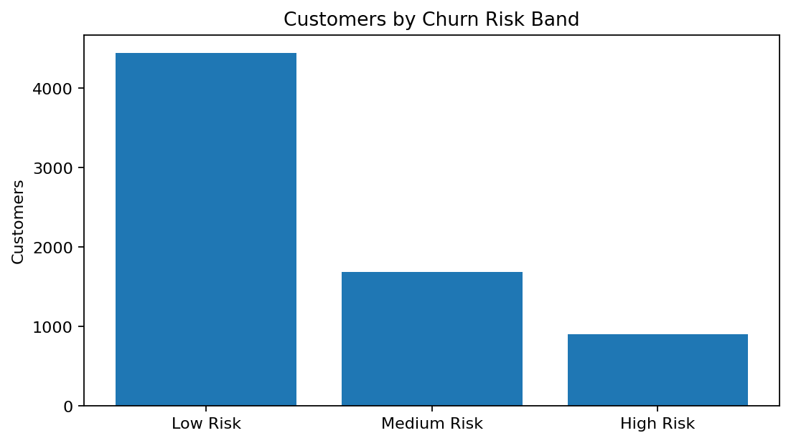
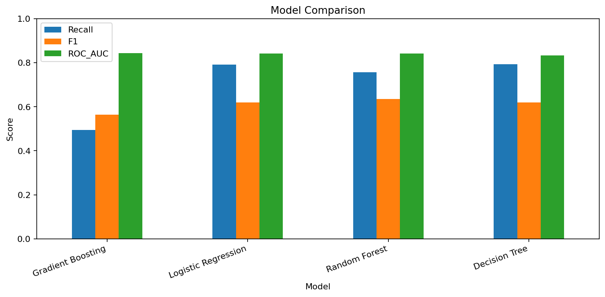
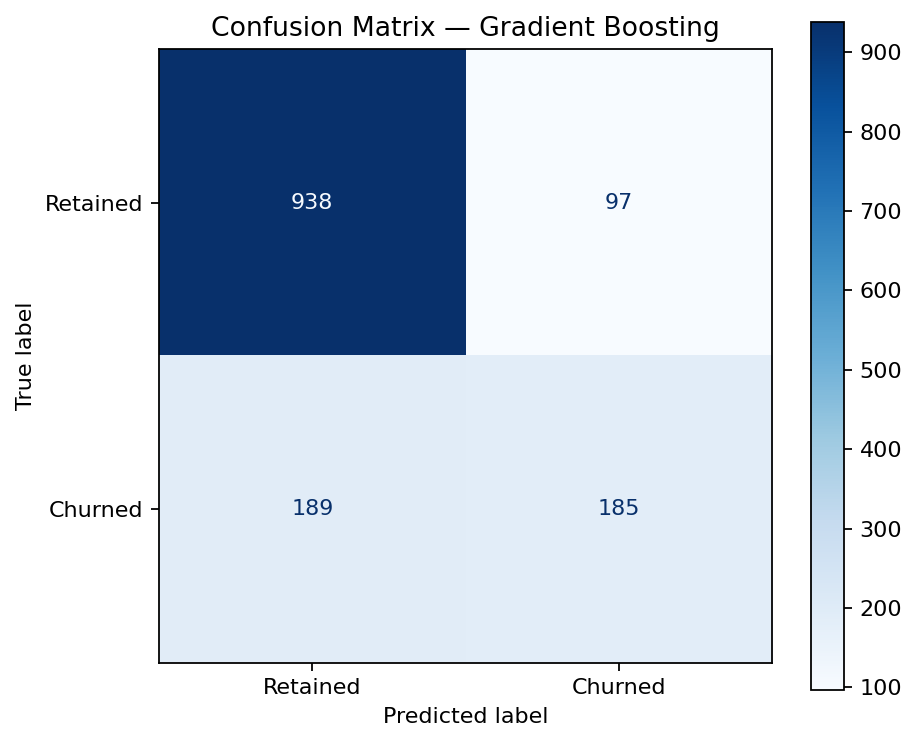
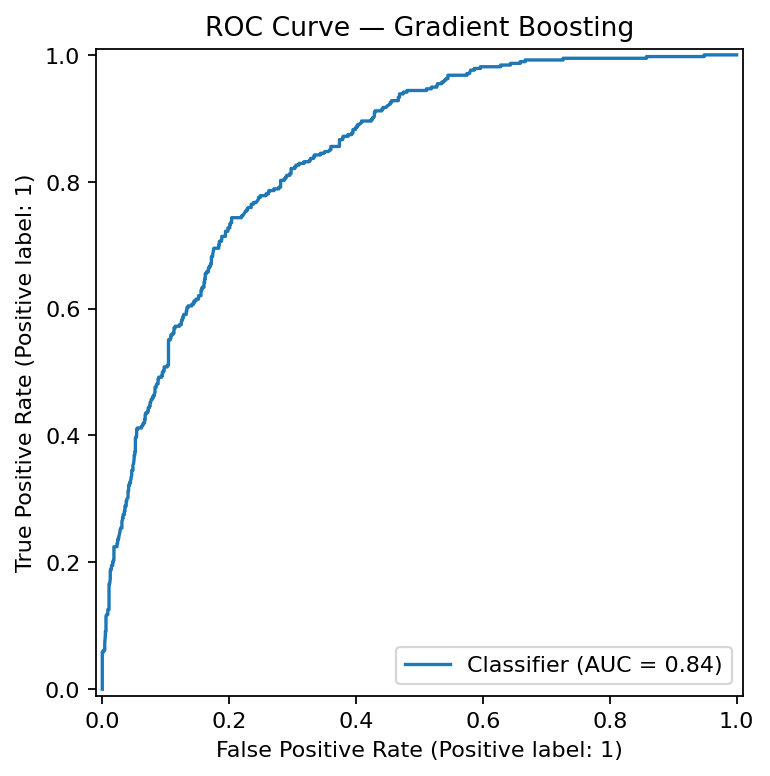

# Customer Churn Prediction & Retention Analytics


An end-to-end customer churn analytics project combining **Python, machine learning, risk scoring and Power BI** to identify customers most likely to leave and support data-driven retention decisions.

## Executive Results

| Metric | Result |
|---|---:|
| Customers | **7,043** |
| Churned customers | **1,869** |
| Retained customers | **5,174** |
| Observed churn rate | **26.54%** |
| High-risk customers | **905** |
| Monthly charges represented by high-risk customers | **$72,337.30** |
| Selected model | **Gradient Boosting** |
| Selected-model ROC-AUC | **0.845** |

## Business Problem

Customer churn reduces recurring revenue and increases acquisition pressure. This project answers four practical questions:

- Which customers are most likely to churn?
- What customer characteristics are associated with churn?
- How accurately can churn be predicted?
- Which customers should retention teams prioritise?

## Dataset

The project uses the public **IBM Telco Customer Churn** dataset with **7,043 customers**.

Key fields include tenure, contract type, internet service, payment method, support/security services, monthly charges, total charges and the churn target.

## Workflow

```text
Raw customer data
        ↓
Data validation & cleaning
        ↓
Exploratory churn analysis
        ↓
Feature engineering
        ↓
Train / test split
        ↓
Model comparison
        ↓
Best-model evaluation
        ↓
Customer churn probabilities
        ↓
Low / Medium / High risk bands
        ↓
Power BI retention dashboard
        ↓
Business recommendations
```

## Feature Engineering

The notebook creates business-friendly features including:

- `TenureGroup`
- `MonthlyChargeBand`
- `ServiceCount`
- `ContractRisk`
- `EstimatedCustomerValue`
- `ChurnProbability`
- `PredictedChurn`
- `RiskBand`
- `MonthlyChargesAtRisk`

## Model Comparison

| Model | Accuracy | Precision | Recall | F1 | ROC-AUC |
|---|---:|---:|---:|---:|---:|
| Gradient Boosting | 0.797 | 0.656 | 0.495 | 0.564 | 0.845 |
| Logistic Regression | 0.742 | 0.509 | 0.791 | 0.620 | 0.842 |
| Random Forest | 0.770 | 0.548 | 0.757 | 0.636 | 0.842 |
| Decision Tree | 0.741 | 0.508 | 0.794 | 0.619 | 0.834 |

**Gradient Boosting** was selected because it achieved the highest held-out ROC-AUC (**0.845**).

> Model-selection note: Logistic Regression and Random Forest achieved higher churn recall than Gradient Boosting at the default 0.50 threshold. In a real retention campaign, the model/threshold should be chosen based on the cost of missed churners versus unnecessary retention interventions.

## Main Churn Patterns

The analysis found the highest churn concentration among:

- **Month-to-month** contract customers
- **Electronic check** customers
- **Fibre optic** internet customers
- Customers in their **first 12 months**
- Customers without **Tech Support**
- Customers without **Online Security**

## Feature Importance

The strongest predictive features in the selected model are:

1. `tenure`
2. `Contract`
3. `InternetService`
4. `TechSupport`
5. `OnlineSecurity`
6. `MonthlyCharges`



## Risk Segmentation

| Risk band | Customers |
|---|---:|
| Low Risk | **4,447** |
| Medium Risk | **1,691** |
| High Risk | **905** |



## Model Evaluation







## Power BI Dashboard

The Power BI report contains four pages:

1. **Executive Overview** - churn KPIs, risk exposure and high-level churn patterns.
2. **Churn Drivers** - churn rate by contract, payment method, internet service, support and monthly-charge band.
3. **Customer Segments** - risk bands, tenure groups, service usage and customer profiles.
4. **Retention & High-Risk Customers** - high-risk exposure and retention-priority views.

Power BI source project:

```text
powerbi/PowerBI_Project/Customer_Churn_ML_PowerBI.pbip
```

After uploading this repository to GitHub, open the `.pbip` file in Power BI Desktop and click **Refresh now**.

## Business Recommendations

- Prioritise high-risk customers for proactive retention outreach.
- Encourage vulnerable month-to-month customers toward longer-term contracts.
- Investigate the experience associated with electronic-check customers.
- Review fibre-optic pricing, support and service quality.
- Strengthen onboarding for customers in their first 12 months.
- Promote Tech Support and Online Security where risk is elevated.
- Combine churn probability with customer value before allocating retention spend.

## Project Structure

```text
03-Customer-Churn-ML-PowerBI/
├── README.md
├── requirements.txt
├── data/
│   ├── telco_churn_cleaned.csv
│   └── churn_risk_predictions.csv
├── notebooks/
│   └── Hassan_Project_3_Customer_Churn_ML_PowerBI_READY.ipynb
├── src/
│   └── churn_pipeline.py
├── models/
│   └── best_churn_model.pkl
├── powerbi/
│   ├── churn_powerbi.csv
│   ├── DAX_Measures.txt
│   └── PowerBI_Project/
│       ├── Customer_Churn_ML_PowerBI.pbip
│       ├── Customer_Churn_ML_PowerBI.Report/
│       └── Customer_Churn_ML_PowerBI.SemanticModel/
├── images/
│   ├── churn_distribution.png
│   ├── churn_by_contract.png
│   ├── churn_by_tenure_group.png
│   ├── churn_by_payment_method.png
│   ├── churn_by_internet_service.png
│   ├── model_comparison.png
│   ├── confusion_matrix.png
│   ├── roc_curve.png
│   ├── feature_importance.png
│   └── risk_band_distribution.png
└── reports/
    ├── Customer_Churn_Analysis_Report.pdf
    ├── model_comparison.csv
    ├── feature_importance.csv
    └── business_findings.txt
```

## How to Run

### Google Colab
Open:

```text
notebooks/Hassan_Project_3_Customer_Churn_ML_PowerBI_READY.ipynb
```

and select **Runtime → Run all**.

### Power BI
After the GitHub repository files have been uploaded, open:

```text
powerbi/PowerBI_Project/Customer_Churn_ML_PowerBI.pbip
```

and refresh the data.

## Skills Demonstrated

Python, Pandas, data cleaning, exploratory data analysis, feature engineering, classification, scikit-learn pipelines, Logistic Regression, Decision Trees, Random Forest, Gradient Boosting, confusion matrices, ROC-AUC, churn-risk scoring, model interpretation, Power BI, DAX, business intelligence, Git and GitHub.

## Author

**Muhammad Hassan**

Data Analyst | Python | SQL | Power BI | Machine Learning | Open Source

## License

MIT License.
