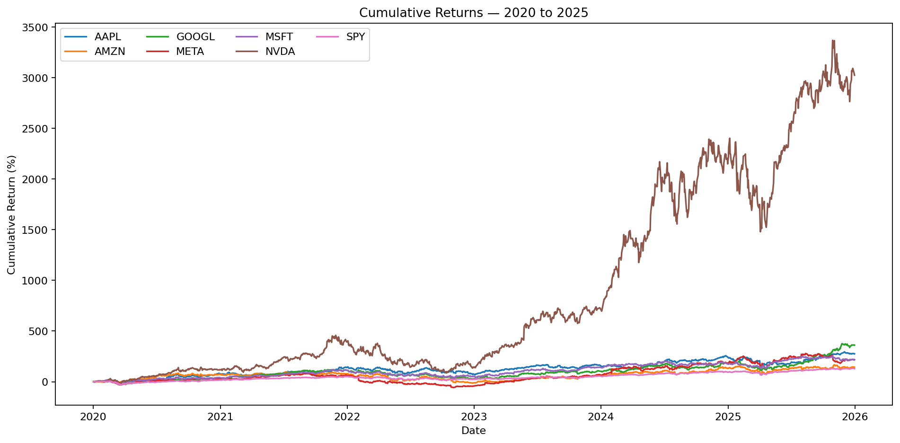
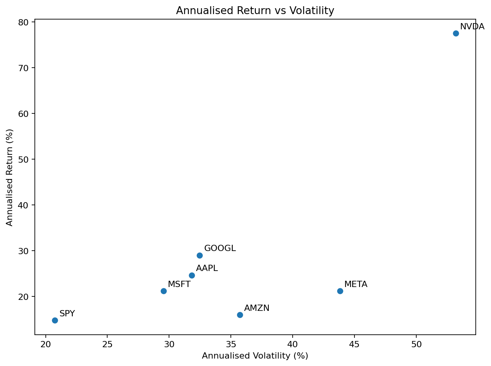
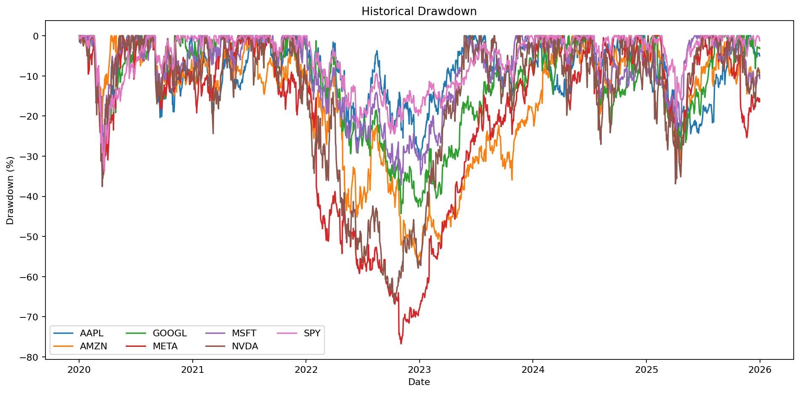
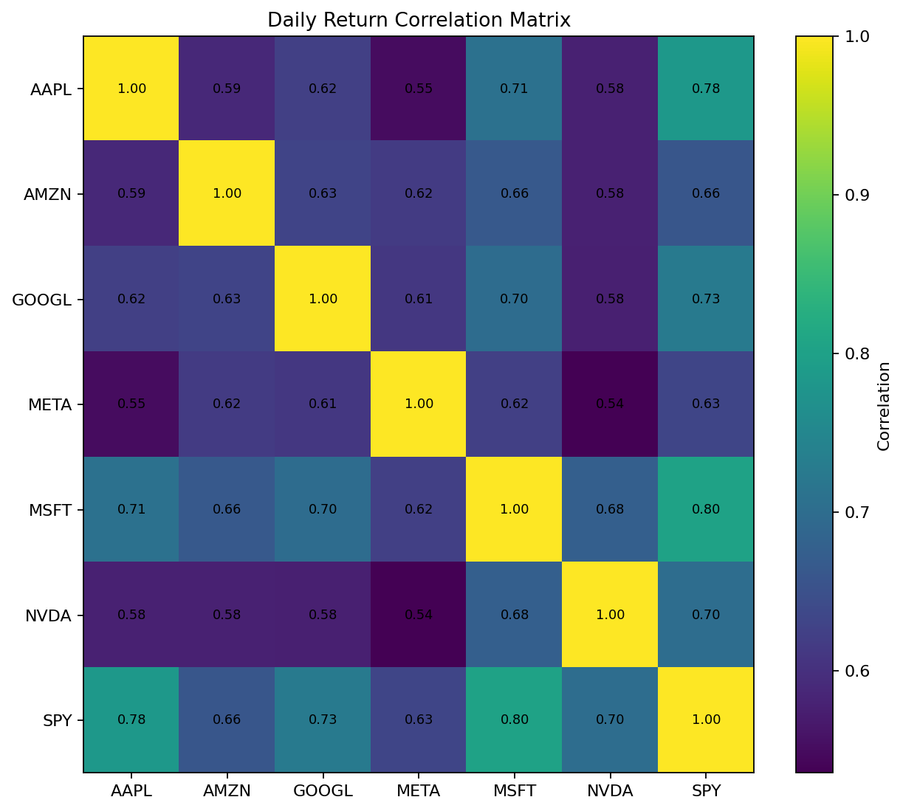
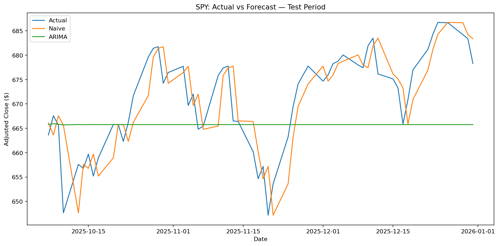

# Stock Market Analytics & Time Series Forecasting


An end-to-end financial analytics portfolio project combining **Python, SQL, risk analytics, time-series forecasting and Power BI**.

> **Educational project only - not financial advice.**

## Project Scope

**Securities:** AAPL, MSFT, NVDA, AMZN, GOOGL, META and SPY  
**Historical period:** 2 January 2020 to 31 December 2025  
**Trading observations:** 1,508 per ticker  
**Forecasting series:** SPY

## Executive Results

| Finding | Result |
|---|---:|
| Highest total return | **NVDA - 3023.39%** |
| Highest annualised volatility | **NVDA - 53.18%** |
| Deepest maximum drawdown | **META - -76.74%** |
| Highest Sharpe-style ratio (0% RF assumption) | **NVDA - 1.46** |
| SPY total return | **129.06%** |
| Best SPY test forecast by RMSE | **Naive Previous Close** |

## Market KPI Comparison

| Ticker | Total Return | Annualised Return | Annualised Volatility | Max Drawdown | Sharpe-style |
|---|---:|---:|---:|---:|---:|
| NVDA | 3023.39% | 77.53% | 53.18% | -66.34% | 1.46 |
| GOOGL | 360.83% | 29.02% | 32.47% | -44.32% | 0.89 |
| AAPL | 275.14% | 24.67% | 31.81% | -33.36% | 0.78 |
| MSFT | 217.12% | 21.23% | 29.55% | -37.15% | 0.72 |
| META | 216.86% | 21.21% | 43.82% | -76.74% | 0.48 |
| AMZN | 143.22% | 15.98% | 35.70% | -56.15% | 0.45 |
| SPY | 129.06% | 14.82% | 20.75% | -33.72% | 0.71 |

## Workflow

```text
Yahoo Finance historical data
        ↓
Validation & cleaning
        ↓
Returns / moving averages / volatility / drawdown
        ↓
Financial KPI analysis
        ↓
SQLite + SQL analytics
        ↓
Cross-security comparison
        ↓
Chronological SPY train/test split
        ↓
Naive baseline vs ARIMA
        ↓
Forecast evaluation
        ↓
Power BI market dashboard
```

## Core Features

- Daily return and log return
- Cumulative return
- 20-day and 50-day moving averages
- 20-day rolling annualised volatility
- Running peak and drawdown
- Volume change
- Year / month / weekday fields
- Multi-security KPI summary
- Daily-return correlation matrix

## SQL Analysis

The project runs **20 SQL analytical queries** in SQLite and includes MySQL-ready scripts for:

- date coverage
- latest historical prices
- total return ranking
- volatility ranking
- maximum drawdown
- best and worst days
- yearly returns
- average monthly returns
- average volume
- positive / negative trading days
- days above the 50-day moving average
- high-volume days
- performance relative to SPY
- period volatility
- day-of-week returns
- risk-adjusted ranking
- large-move days
- window-function return ranking
- Power BI summary output

## Return & Risk Visuals









## Forecasting

SPY is evaluated using a **chronological 60-trading-day test period**.

| Model | MAE | RMSE | MAPE |
|---|---:|---:|---:|
| Naive Previous Close | $4.16 | $5.41 | 0.62% |
| ARIMA(5,1,0) | $9.39 | $11.09 | 1.39% |

The **Naive Previous Close** achieved the lowest test RMSE (**5.41**).

This is an important modelling result: the ARIMA model did **not** outperform the simple baseline on this test window.



## Future Forecast

A 20-business-day ARIMA model forecast is exported as:

```text
data/future_20day_forecast.csv
```

This future path is included as a modelling demonstration only and should not be interpreted as a guaranteed market prediction.

## Power BI Dashboard

The Power BI project contains four pages:

1. **Market Overview** - SPY price/cumulative return, trading records, volume and historical market context.
2. **Returns & Risk** - total return, annualised return, volatility, drawdown and risk-adjusted comparison.
3. **Security Comparison** - cross-security rankings, yearly performance and benchmark-oriented comparison.
4. **Forecast & Model Evaluation** - actual vs predicted SPY prices, baseline vs ARIMA error metrics and the future model forecast.

Open:

```text
powerbi/PowerBI_Project/Stock_Market_Analytics_Forecasting.pbip
```

After this repository has been uploaded to GitHub, click **Refresh now** in Power BI Desktop.

## Project Structure

```text
04-Stock-Market-Analytics-Forecasting/
├── README.md
├── requirements.txt
├── market_analytics.sqlite
├── data/
│   ├── market_data_cleaned.csv
│   ├── market_kpi_summary.csv
│   ├── correlation_matrix.csv
│   ├── yearly_performance.csv
│   ├── forecast_predictions.csv
│   └── future_20day_forecast.csv
├── notebooks/
│   └── Hassan_Project_4_Stock_Market_Analytics_Forecasting_READY.ipynb
├── sql/
│   ├── database_setup.sql
│   ├── cleaning_queries.sql
│   └── analysis_queries.sql
├── sql_results/
├── src/
│   └── market_analytics_pipeline.py
├── models/
│   └── forecasting_model.pkl
├── powerbi/
│   ├── market_powerbi.csv
│   ├── market_kpi_summary.csv
│   ├── yearly_performance.csv
│   ├── forecast_test_predictions.csv
│   ├── future_20day_forecast.csv
│   ├── DAX_Measures.txt
│   └── PowerBI_Project/
├── images/
│   ├── cumulative_returns.png
│   ├── volatility_comparison.png
│   ├── drawdown.png
│   ├── correlation_heatmap.png
│   └── forecast_vs_actual.png
└── reports/
    ├── Stock_Market_Analytics_Forecasting_Report.pdf
    ├── business_findings.txt
    └── forecast_model_comparison.csv
```

## How to Run

### Google Colab
Open:

```text
notebooks/Hassan_Project_4_Stock_Market_Analytics_Forecasting_READY.ipynb
```

and select **Runtime -> Run all**.

### SQL
Use the files under `sql/` for MySQL-ready setup and analysis. The notebook itself creates a SQLite database for one-click reproducibility.

### Power BI
Upload the GitHub project first, then open the `.pbip` project in Power BI Desktop and refresh the web data sources.

## Skills Demonstrated

Python, Pandas, yfinance, financial analytics, SQL, SQLite, MySQL-ready SQL, window functions, returns, volatility, drawdown, correlation analysis, risk-adjusted performance, ARIMA, forecasting baselines, chronological validation, MAE, RMSE, MAPE, Power BI, DAX, Git and GitHub.

## Limitations

- Market prices are difficult to forecast and can respond to information not present in historical price data.
- The 0% risk-free-rate Sharpe-style ratio is an explicit simplifying assumption.
- Future forecast dates use business days rather than a full exchange trading calendar.
- The fixed 2020-2025 dataset should be treated as a historical portfolio analysis, not a current trading signal.

## Author

**Muhammad Hassan**

Data Analyst | Python | SQL | Power BI | Machine Learning | Open Source

## License

MIT License.
