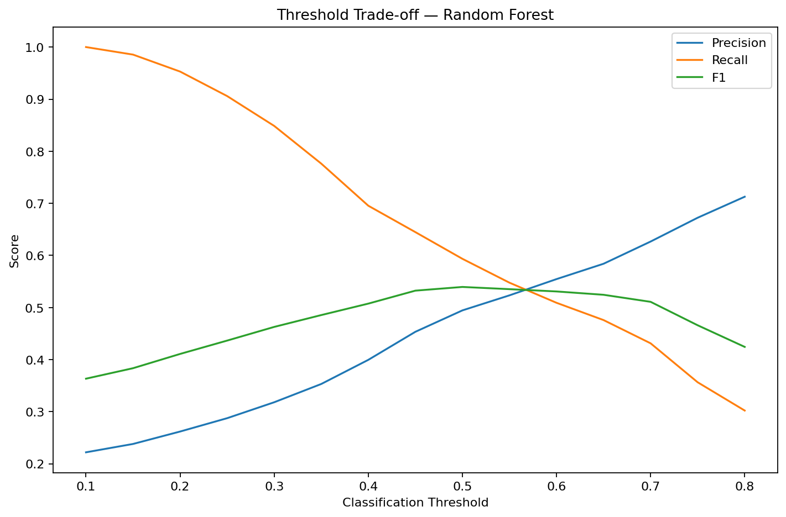
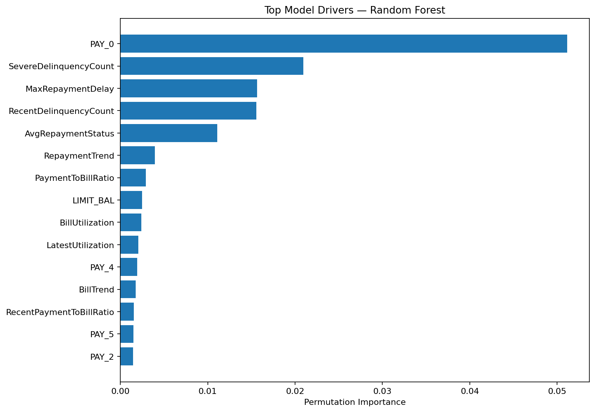
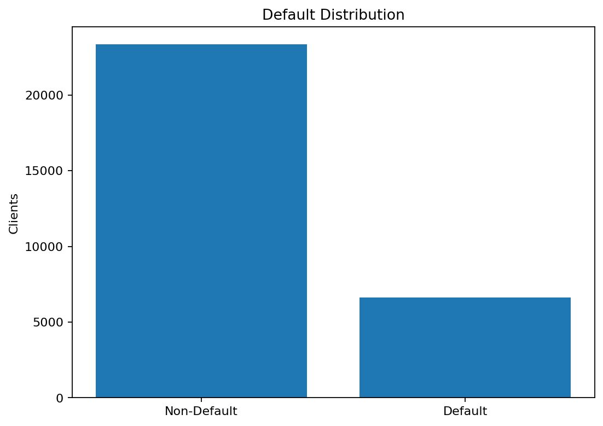
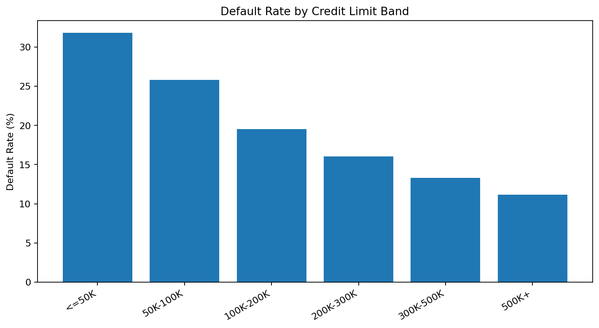
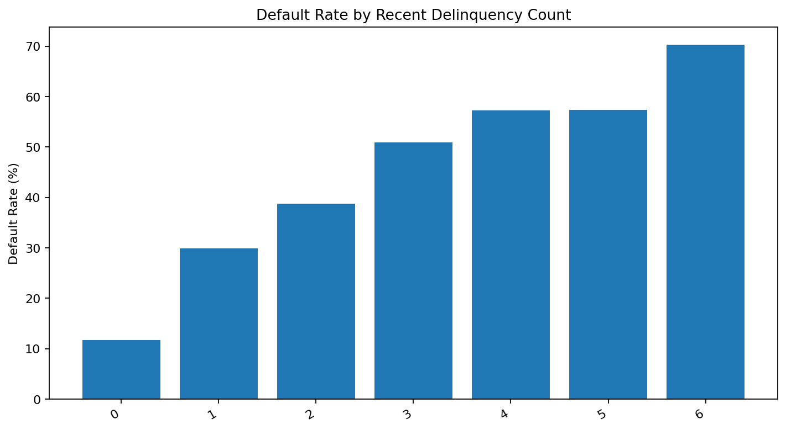
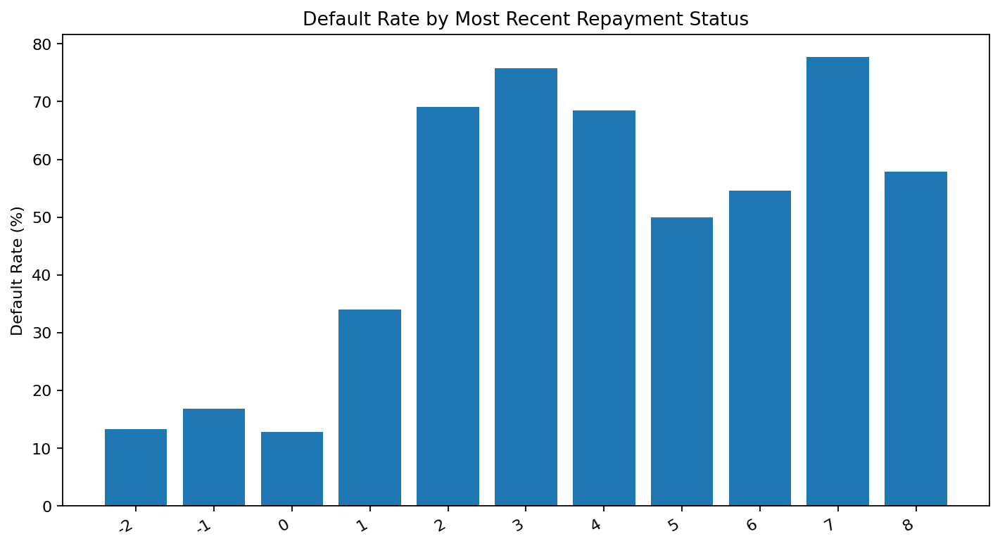
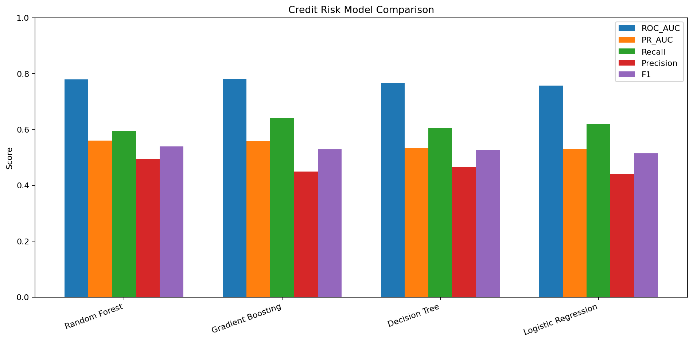
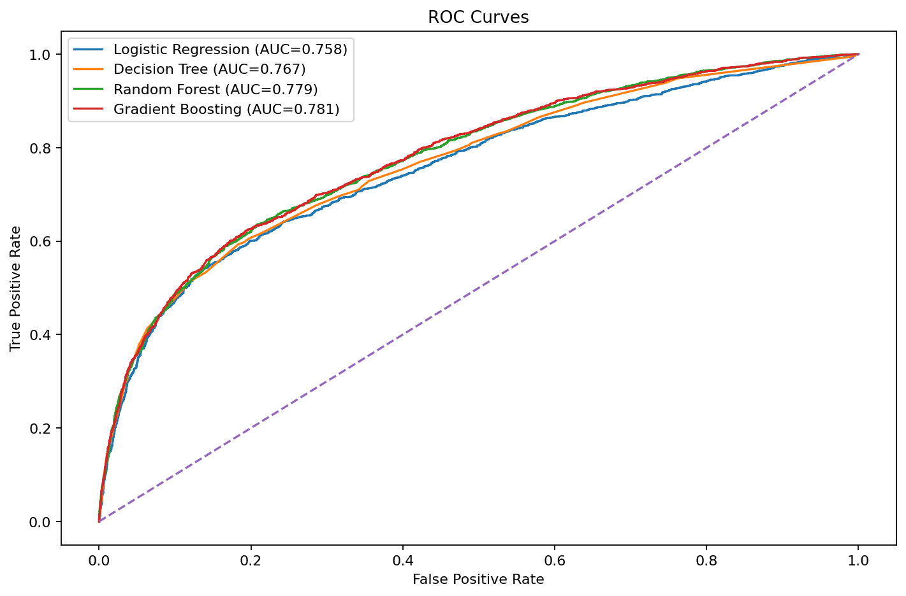
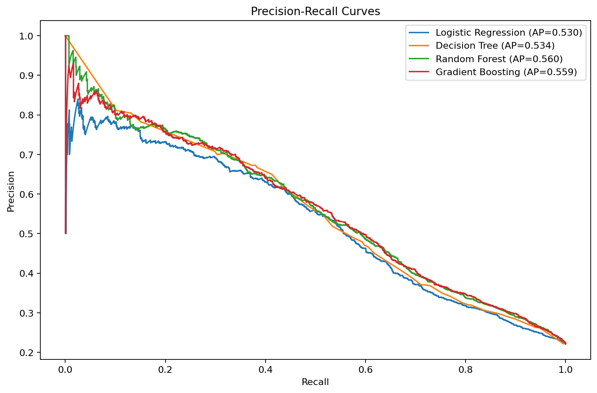
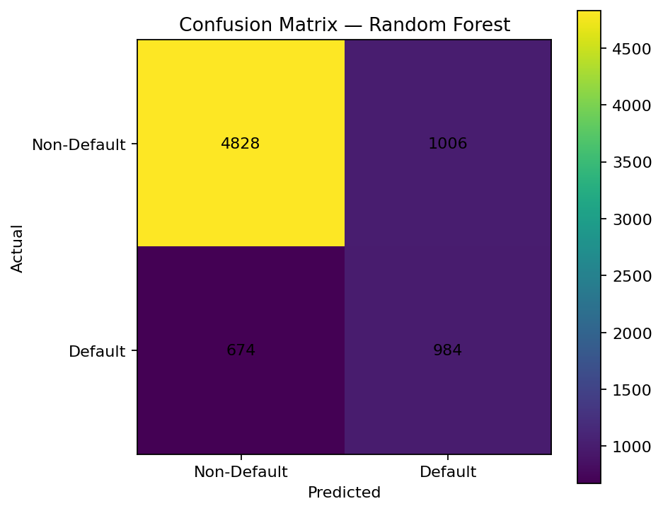

# Credit Risk & Loan Default Prediction with Explainable ML


An end-to-end **credit-risk analytics and explainable machine-learning** portfolio project using the UCI **Default of Credit Card Clients** dataset.

> **Responsible-use note:** This project is educational portfolio analytics only. It is not an automated lending approval or rejection system.

## Project Scope

- **Clients analysed:** 29,965
- **Observed defaults:** 6,630
- **Overall default rate:** 22.13%
- **Models:** Logistic Regression, Decision Tree, Random Forest, Gradient Boosting
- **Selected model:** Random Forest
- **Primary selection metric:** PR-AUC

## Executive Results

| Finding | Result |
|---|---:|
| Overall default rate | **22.13%** |
| Selected model | **Random Forest** |
| Test Accuracy | **0.776** |
| Test Precision | **0.494** |
| Test Recall | **0.593** |
| Test F1 | **0.539** |
| Test ROC-AUC | **0.779** |
| Test PR-AUC | **0.560** |
| Best-F1 threshold tested | **0.50** |
| High-risk clients | **8,113** |
| High-risk observed default rate | **54.55%** |
| High-risk credit-limit exposure proxy | **939,663,680** |

## Workflow

```text
UCI Credit Dataset
        ↓
Cleaning & Validation
        ↓
Descriptive Credit-Risk Analysis
        ↓
Behavioural Feature Engineering
        ↓
SQLite + SQL Portfolio Analysis
        ↓
Stratified Train/Test Split
        ↓
4 Classification Models
        ↓
PR-AUC / ROC-AUC / Recall / Precision / F1
        ↓
Threshold Analysis
        ↓
Probability Risk Bands
        ↓
Permutation Feature Importance
        ↓
Power BI Dashboard
```

## Responsible Modelling

The predictive model **excludes**:

- Sex
- Education
- Marital status
- Age

These fields remain available only for **descriptive audit views**.

This does **not** prove that the model is fair. Other variables can act as proxies, so a real lending deployment would still require formal fairness testing, governance, monitoring and human review.

## Risk-Band Validation

| Risk Band | Clients | Avg Predicted Risk | Observed Default Rate | Credit-Limit Exposure |
|---|---:|---:|---:|---:|
| Low | 5,406 | 15.34% | 2.05% | 1,468,560,000 |
| Medium | 16,446 | 33.01% | 12.73% | 2,609,176,000 |
| High | 8,113 | 72.31% | 54.55% | 939,663,680 |

The increasing observed default rate across Low, Medium and High bands provides a useful portfolio-level validation check.

## Model Comparison

| Model | Accuracy | Precision | Recall | F1 | ROC-AUC | PR-AUC |
|---|---:|---:|---:|---:|---:|---:|
| Random Forest | 0.776 | 0.494 | 0.593 | 0.539 | 0.779 | 0.560 |
| Gradient Boosting | 0.747 | 0.449 | 0.641 | 0.528 | 0.781 | 0.559 |
| Decision Tree | 0.759 | 0.465 | 0.606 | 0.526 | 0.767 | 0.534 |
| Logistic Regression | 0.742 | 0.441 | 0.619 | 0.515 | 0.758 | 0.530 |

The selected model is **Random Forest** because it achieved the highest test **PR-AUC (0.560)**.

Gradient Boosting achieved a slightly higher ROC-AUC than Random Forest, but its PR-AUC was lower. The project deliberately uses an imbalance-aware model-selection rule rather than Accuracy alone.

## Threshold Analysis

The notebook evaluates thresholds from **0.10 to 0.80**.

The highest test F1 in that sweep occurred at **0.50**.

Lower thresholds increase recall but also increase the number of clients flagged as higher risk. Higher thresholds improve precision but miss more observed defaults.



## Explainability

Permutation importance was calculated using average-precision scoring.

Top model features:

1. **PAY_0** - importance 0.0511
2. **SevereDelinquencyCount** - importance 0.0210
3. **MaxRepaymentDelay** - importance 0.0156
4. **RecentDelinquencyCount** - importance 0.0156
5. **AvgRepaymentStatus** - importance 0.0111
6. **RepaymentTrend** - importance 0.0040
7. **PaymentToBillRatio** - importance 0.0029
8. **LIMIT_BAL** - importance 0.0025
9. **BillUtilization** - importance 0.0024
10. **LatestUtilization** - importance 0.0021



Feature importance explains model sensitivity, **not causality**.

## Credit-Risk Analysis









## Model Evaluation Visuals









## SQL Analysis

The project creates a SQLite database for reproducibility and MySQL-ready SQL scripts for portfolio analysis.

SQL outputs include:

- portfolio overview
- default by credit-limit band
- default by repayment status
- default by age / education / marital status for descriptive audit
- repeated delinquency
- bill and payment behaviour
- high-limit late-payment accounts
- delinquency-band analysis
- payment-to-bill ratio bands
- window-function credit-limit ranking
- risk-band exposure
- high-risk client extract
- post-model portfolio risk summary

## Power BI Dashboard

The Power BI project contains four pages:

1. **Credit Portfolio Overview** - clients, observed default rate, credit exposure, limit bands and portfolio risk bands.
2. **Repayment & Default Drivers** - repayment status, delinquency, bill utilisation, payment behaviour and feature importance.
3. **Customer Risk Segments** - Low / Medium / High risk bands, observed default validation, exposure and descriptive demographic audit views.
4. **Model Performance & Explainability** - PR-AUC, ROC-AUC, recall, precision, F1, threshold trade-offs and feature importance.

Open:

```text
powerbi/PowerBI_Project/Credit_Risk_Explainable_ML.pbip
```

Upload the project to GitHub first, then open the PBIP project and select **Refresh now** in Power BI Desktop.

## Project Structure

```text
05-Credit-Risk-Explainable-ML/
├── README.md
├── requirements.txt
├── credit_risk.sqlite
├── data/
│   ├── credit_risk_cleaned.csv
│   ├── credit_risk_predictions.csv
│   └── risk_band_summary.csv
├── notebooks/
│   └── Hassan_Project_5_Credit_Risk_Explainable_ML_FIXED_v2.ipynb
├── sql/
│   ├── database_setup.sql
│   ├── cleaning_queries.sql
│   └── analysis_queries.sql
├── sql_results/
├── src/
│   └── credit_risk_pipeline.py
├── models/
│   └── best_credit_risk_model.pkl
├── powerbi/
│   ├── credit_risk_powerbi.csv
│   ├── model_comparison.csv
│   ├── threshold_analysis.csv
│   ├── feature_importance.csv
│   ├── risk_band_summary.csv
│   ├── DAX_Measures.txt
│   └── PowerBI_Project/
├── images/
├── reports/
│   ├── Credit_Risk_Explainable_ML_Report.pdf
│   ├── business_findings.txt
│   ├── model_comparison.csv
│   ├── threshold_analysis.csv
│   └── feature_importance.csv
└── README.md
```

## How to Run

### Google Colab

Open:

```text
notebooks/Hassan_Project_5_Credit_Risk_Explainable_ML_FIXED_v2.ipynb
```

and select **Runtime -> Run all**.

### SQL

The notebook creates:

```text
credit_risk.sqlite
```

MySQL-ready scripts are under:

```text
sql/
```

### Power BI

Upload the GitHub project first, then open the `.pbip` project from:

```text
powerbi/PowerBI_Project/
```

Refresh the GitHub raw CSV sources. If prompted, use **Anonymous / Public** access.

## Skills Demonstrated

Python, Pandas, scikit-learn, imbalanced classification, Logistic Regression, Decision Tree, Random Forest, Gradient Boosting, PR-AUC, ROC-AUC, threshold analysis, confusion matrix, probability scoring, risk segmentation, permutation feature importance, SQL, SQLite, MySQL-ready SQL, Power BI, DAX, Git and GitHub.

## Limitations

- This is a historical educational dataset and does not represent a current lender portfolio.
- The risk bands are analytical categories, not lending-policy thresholds.
- The selected model is not calibrated for real-world probability-of-default use.
- Excluding demographic variables does not establish fairness.
- Feature importance is not causal evidence.
- Real deployment would require policy review, calibration, fairness testing, governance, drift monitoring and human oversight.

## Author

**Muhammad Hassan**

Data Analyst | Python | SQL | Power BI | Machine Learning

## License

MIT License.
